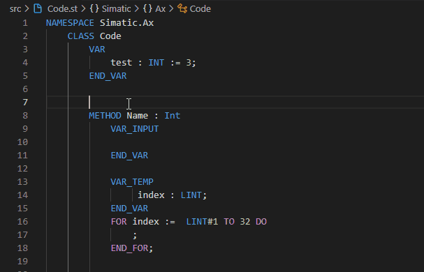
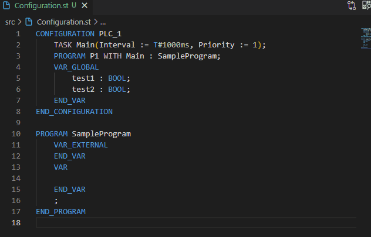
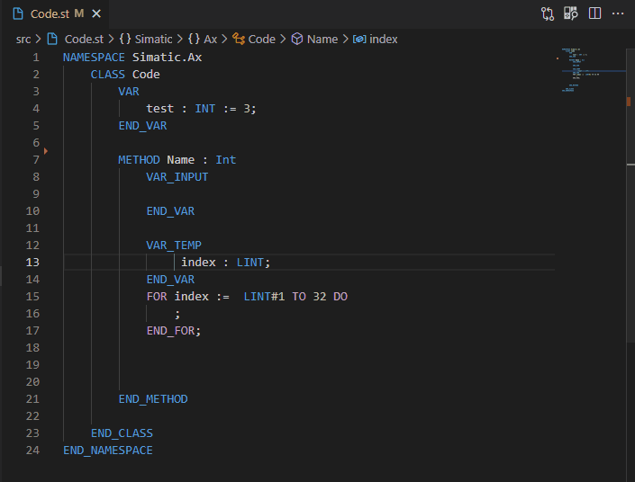
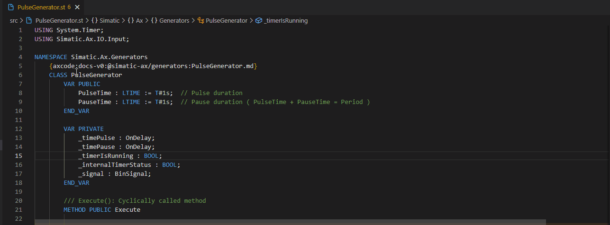
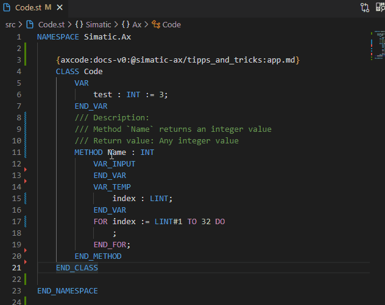
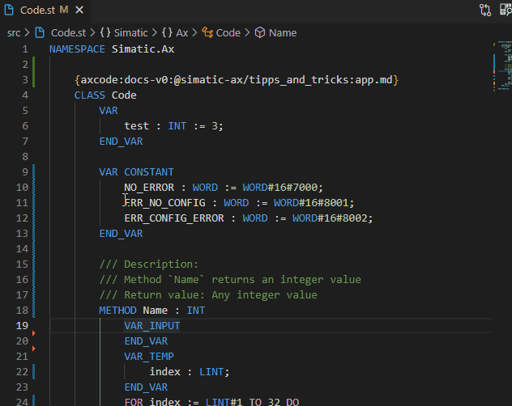
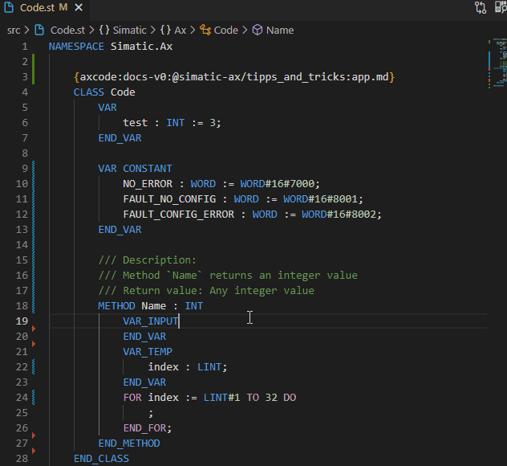
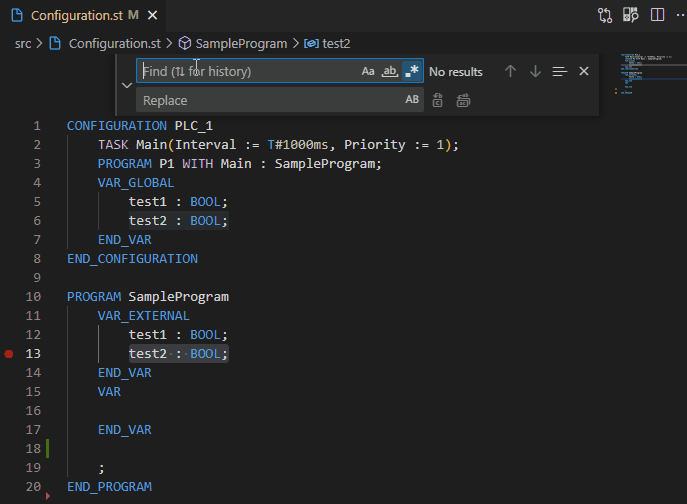

# Tips & Tricks with AX Code

## Snippets

### Simple snippet example

```json
{
    "comment_snippet": {
    "scope": "st",
    "prefix": ["comment, snippet"],
    "body": [
        "/// Block description 2",
        "/// $(1|place here the comment of method)",
        "/// Return value: $2",
        "${name:default}"
    ],
    "description": "Add an Comment;"
    }
}
```

Result:



### Loop snippet

```json
{
    "loop":
    {
        "prefix": ["loop"],
        "scope": "st",
        "body":[
            "VAR_TEMP",
            "\t index : ${1|INT,LINT|};",
            "END_VAR",
            "FOR index :=  ${1|INT,LINT|}#${2|0,1,X|} TO ${3:EndValue} DO",
            "\t;",
            "END_FOR;"
        ],
    "description": "create a loop section with VAR_TEMP;"
    }
}
```

Result:


## Import global variables

Importing global variables into the `VAR_EXTERNAL` section of a POU



## Format ST code



## Documentation

> Currently not productive; it might not always work

### Documentation link



Further information: [Documentation Link](https://console.simatic-ax.siemens.io/docs/axcode/library-toolbox/docs-v0)

### Inline Documentation

In SIMATIC AX you can add comments to your methods or functions with `///`



## Nice shortcuts

A complete overview of the shortcuts in `VS Code`/`AX Coce` you'll find here: [VS Code shortcuts](https://code.visualstudio.com/shortcuts/keyboard-shortcuts-windows.pdf)

### Add selection to next Find match (CTRL+D)



### Insert cursor (Alt+Click)



## Search & Replace with Regex



## Further information

[AX Code Documentation](https://console.simatic-ax.siemens.io/docs/axcode/vscode-user-snippets)

[Documentation Link](https://console.simatic-ax.siemens.io/docs/axcode/library-toolbox/docs-v0)

[VS Code Documentation](https://code.visualstudio.com/docs/editor/userdefinedsnippets#_create-your-own-snippets)

[Snippets collection on GitHub](https://github.com/simatic-ax/snippetscollection)

[PLC Open templates](https://github.com/simatic-ax/plcopen-snippets)

### Markdownlint-cli

This workspace will be checked by the [markdownlint-cli](https://github.com/igorshubovych/markdownlint-cli) (there is also documented ho to install the tool) tool in the CI workflow automatically.  
To avoid, that the CI workflow fails because of the markdown linter, you can check all markdown files locally by running the markdownlint with:

```sh
markdownlint **/*.md --fix
```

## License and Legal information

Please read the [Legal information](LICENSE.md)
