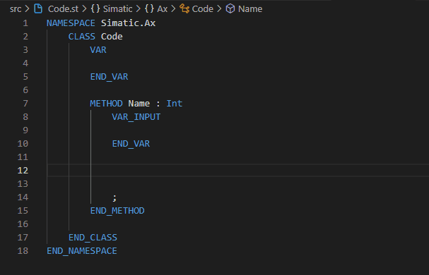

# Tips & Tricks with AX Code

## Snippets

### Simple snippet example:

```json
{
    "comment_snippet": {
    "scope": "st",
    "prefix": ["comment, snippet"],
    "body": [
        "/// Block description 2",
        "/// $(1|place here the comment of method)",
        "/// Return value: $2",
        "${name:default}"
    ],
    "description": "Add an Comment;"
    }
}
```

Result:


### Loop snippet:

```json
{
    "loop":
    {
        "prefix": ["loop"],
        "scope": "st",
        "body":[
            "VAR_TEMP",
            "\t index : ${1|INT,LINT|};",
            "END_VAR",
            "FOR index :=  ${1|INT,LINT|}#${2|0,1,X|} TO ${3:EndValue} DO",
            "\t;",
            "END_FOR;"
        ],
    "description": "create a loop section with VAR_TEMP;"
    }
}
```

Result:



## Further information

[AX Code Documentation](https://console.simatic-ax.siemens.io/docs/axcode/vscode-user-snippets)

[VS Code Documentation](https://code.visualstudio.com/docs/editor/userdefinedsnippets#_create-your-own-snippets)

[Snippets collection on GitHub](https://github.com/simatic-ax/snippetscollection)

[PLC Open templates](https://github.com/simatic-ax/plcopen-snippets)

## License and Legal information

Please read the [Legal information](LICENSE.md)
